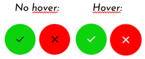
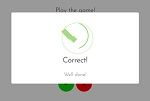
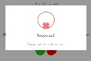
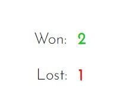
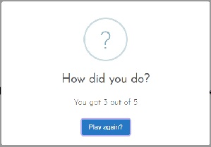
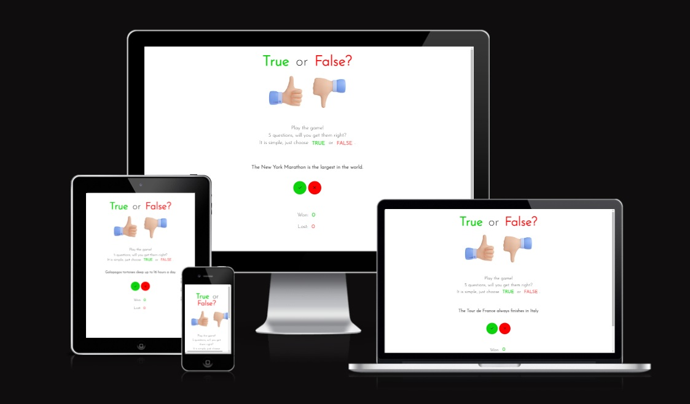
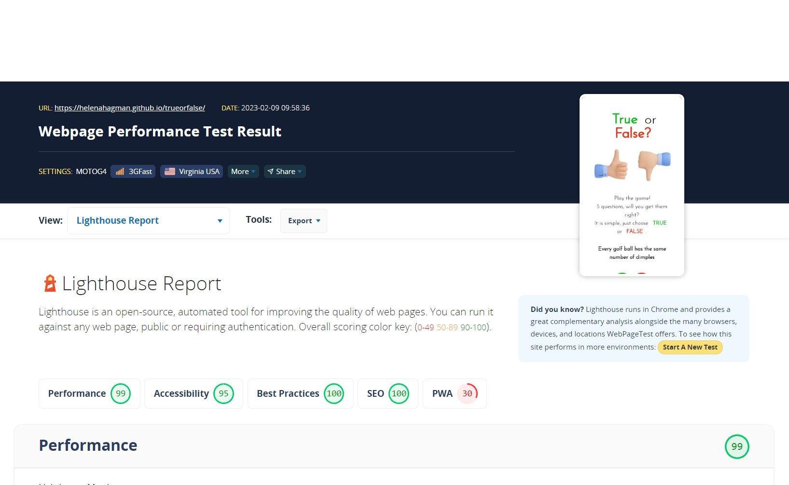

<section>
  <h1>True or False game</h1>
</section>
<section>
  <h2>Description</h2>
   
  
   
  
This is a single page, True or False game. The user will be presented with questions that can be answered with either True or False. The goal for the user is to be able to play a simple but entertaining online game with fun and slightly unusual questions. The site owner's goal is to provide a quick and fun game that can by played by anyone as the chans of a correct answer for each question is 50%. After 5 questions the user will be asked if they want to play again. 
    
   The plan was to include features like: 
   <ul>
     <li>Feedback on answered questions.</li>
     <li>Display random questions from the question bank.</li>
     <li>Score tracking system that updated the score after each question.</li>
     <li>Images to support the instant feedback for both correct and incorrect answers.</li>
     <li>Play again button displayed for the user after the 5 questions have been answered.</li>
   </ul> 
  

   
</section>
<section>
  

  When the user hovers over the true button the black check symbol will turn white, the same rules apply for the red false button.
    
  
   
  When the true or false buttons are clicked the user will get instant feedback with an emoji showing if the answer is correct or incorrect. 
  
   
  Underneath the buttons on the page the score will show how many correct and incorrect answers the user has.
   
   
    
  After the 5 questions have been displayed the user will get a pop-up with the total score and the question to play again.
   
  
  

   
<h2>Features</h2>
   
  <h3>Game page</h3>
    <ul>
     <li>Single page game</li>
     <li>Clickable True and False buttons to answer the game questions.</li>
     <li>Instant feedback for correct and incorrect answers.</li> 
     <li>Hoover function on the True and False buttons.</li>
     <li>Clear and consistant visual design through out the page, with green representing true and red representing false</li>
     <li>Accessible and easy to navigate with no distractions</li>
  
     
</section>
<section>
<h2>Testing</h2>
   
  <ul>
    <li>I tested and confirmed that the site is responsive and looks good on diffrent screen sizes using the devtools device toolbar, Am I Responsive and Lighthouse.</li>
   
  

    
  

   
  

   
  

  
   
   <li>I tested and confirmed that the game questions display correctly.</li>
   <li>I tested and confirmed that the game buttons work with the instant feedback function with an emoji.</li>
   <li>I tested and confirmed that the score updates as expected.</li>
  </ul>
 
</section>

<section>
<h2>Bugs</h2>
   
  <ul>
   <li>Questions did not show on the page - fixed  The code was missing the the div id="question". After updating the code the questions show</li>
   <li>True button didnt work - fixed  The code was missing some characters. After updating the code the True button works as expected.</li>
   <li>The score is not updated - fixed  Added and updated the incrementScore function after watching the walk through project again. The update is now working as expected.</li>
   <li>The score is not updated when game starts over - fixed Updated the code with the help of @FabioFaria in Slack</li>
  </ul>
 
<h2>Unfixed Bugs</h2>
   
  <ul>
   <li>No unfixed bugs detected</li>
  </ul>
   
</section>

<section>
<h2>Badges</h2>
   
  <ul>
  <li>CSS validation complete with no errors</li>
   
  

    
  

   
  <li>HTML validation complete with no errors or warning, using https://validator.w3.org/</li>
   
  
JSHint validation completed, using https://jshint.com/
  <ul>Warnings: <li>Undefined variable Swal - Variable is defined in the importet library from Sweet Alert.</li>
  <li>Unused variables true_clicked and false_clicked - Corrected in the code.</li>
  </ul>
  

  </ul>
   
</section>

<section>
<h2>Support</h2>
   
  
Useful links for validation and help:

   <ul>
    <li><a href="https://www.w3schools.com/">https://www.w3schools.com/</a></li>
     <ul>Searched for assistance and tips</ul>
    <li><a href="https://teamtreehouse.com/community/how-do-i-use-mathrandom-on-an-array-of-questions">https://teamtreehouse.com/community/how-do-i-use-mathrandom-on-an-array-of-questions</a></li>
     <ul>Searched for help with the display of random questions</ul>
    <li><a href="https://fonts.google.com/">https://fonts.google.com/</a></li>
     <ul>Fonts and icons for the game.</ul>
    <li><a href="https://validator.w3.org/">https://validator.w3.org/</a></li>
     <ul>Validation of the HTML code.</ul>
    <li><a href="https://jigsaw.w3.org/css-validator/">https://jigsaw.w3.org/css-validator/</a></li>
     <ul>Validation of the CSS code.</ul>
    <li><a href="https://jshint.com/">https://jshint.com/</a></li>
     <ul>Validation of the Java Script code.</ul>
    <li><a href="https://www.webpagetest.org/">https://www.webpagetest.org/</a></li>
     <ul>Test of the page</ul>
    <li><a href="https://ui.dev/amiresponsive">https://ui.dev/amiresponsive</a></li>
     <ul>Validation of the responsiveness of the page</ul>
    <li><a href="https://www.javatpoint.com/javascript-tutorial">https://www.javatpoint.com/javascript-tutorial</a></li>
     <ul>Tips for Java Script</ul>
    <li></li>
     <ul>Colors for the game page</ul> 
   </ul>
   
</section>

<section>
 <h2>Future releases</h2>
   
   
No future releases planned at the moment

   

<h2>Acknowledgments</h2>
   
  
Special thanks to:

 <ul>
  <li>My Mentor Jubril Akolade for input and useful tips.</li>
  <li><a href="https://www.freepik.com/free-photo/3d-render-set-like-dislike-hand-sign-icons_35672122.htm#page=2&query=true%20false&position=36&from_view=keyword">Image by upklyak</a> on Freepik
   
  
  <li>Fabio Faria in the Slack community for help on solving my problem with the score not resetting when a new game started</li>
  </ul>
   
</section>
<section>
 <h2>Deployment</h2>
   
  <ul>
   <li>The site was deployed to GitHub pages, following the steps from the Love Running Project.</li>
  </ul>
<h3>Live site</h3>
   
   

   https://helenahagman.github.io/trueorfalse/
   

</section>

